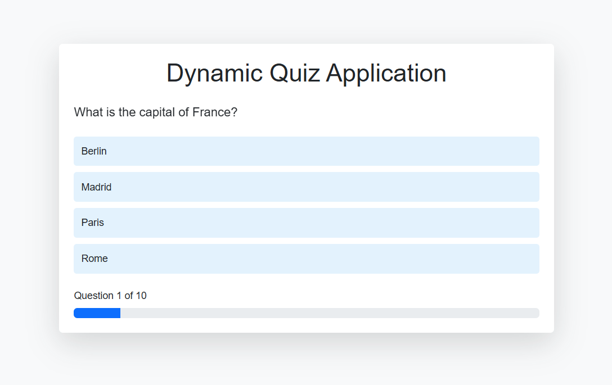
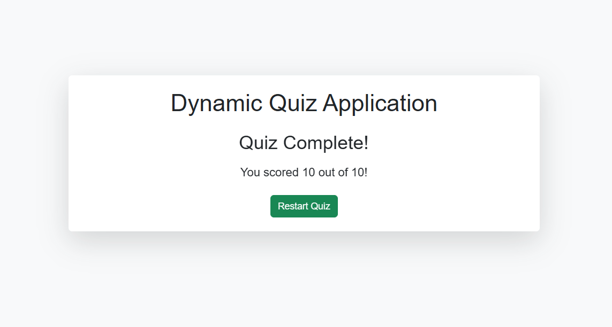
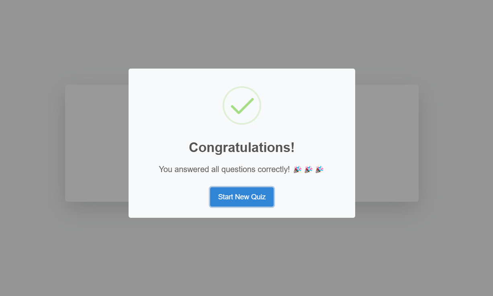

# Quiz Application 📝

**Company**: CodeTech IT Solutions  
**Name**: MAYANK VERMA 
**Intern ID**: CTO4WY20  
**Domain**: FRONT END DEVELOPMENT  
**Duration**: 4 WEEEKS 
**Mentor**: NEELA SANTOSH

An interactive web-based quiz application with instant feedback and score tracking.

## Features ✨
- Multiple-choice questions
- Real-time feedback
- Progress tracking
- Score display
- Celebration animation for perfect scores

## Tech Stack 🛠️
- HTML5, CSS3, JavaScript
- SweetAlert2 & Animate.css

## Quick Start 🚀
1. Open `index.html` in browser
2. Answer questions
3. Get instant feedback
4. View score
5. Restart quiz

## Screenshots 🖼️

